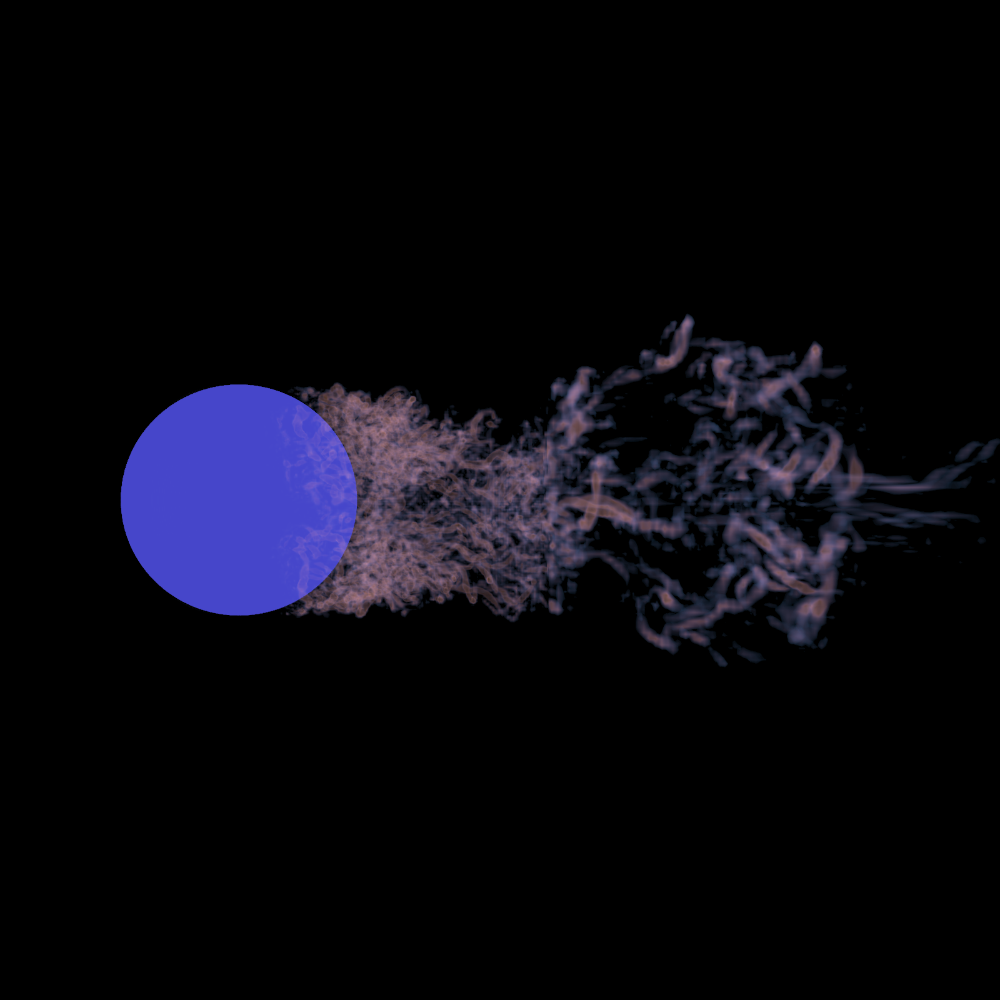

# Ray tracing based multi-resolution iso-surface rendering

Group Number:
* Member 1: 任辉 2021533089
* Member 2: 李亦安 2020533066
* Member 3: 宋海瑜 2020533079

## Guide

The report folder contains our overview of the project and implementation.

The root folder contains all the program including cmakelist, src, include, and third-party libraries. 

To run the program, you should pass in the config file to it, e.g. configs/multi-big.json

The window size of ui is the same as "image_resolution" in config. It will load vdb data in "file_path" parameter.

You can change parameters in config file, or you can just use ui to change some parameters like iso_value, step_scale, you can even define color map in ui.

If you want better result quality, you can reduce step_scale and enlarge spp, but this would increase time cost.
